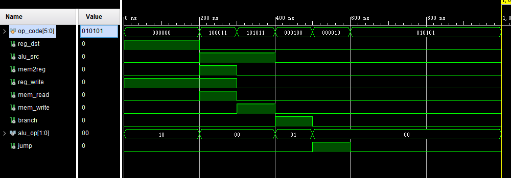
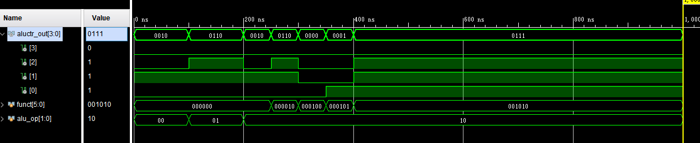
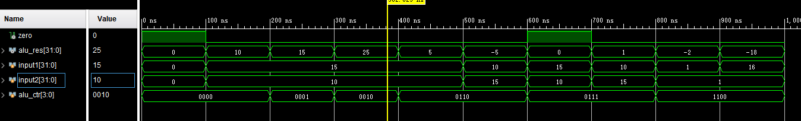
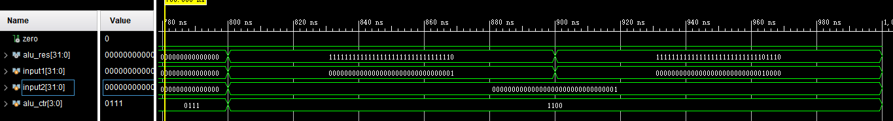

## 计算机系统结构实验Lab3

### 简单的类MIPS单周期处理器部件实现：控制器与ALU

> 姓名：陈文浩
>
> 学号：519030910217

[TOC]

<div STYLE="page-break-after: always;"></div>

### 1.实验目的

1. 理解CPU控制器、ALU控制器、ALU的原理
2. 实现主控制器Ctr
3. 实现ALU控制器ALUCtr
4. 实现ALU
5. 功能仿真

### 2.原理分析

#### 2.1 主控制器(Ctr)原理分析

​	主控制器单元(Ctr)的输入为指令的opCode 字段，操作码经过Ctr 的译码，给ALUCtr，Data Memory，Registers，Muxs 等部件输出正确的控制信号。

​	MIPS指令集主要可以分为R-指令，I-指令，J-指令三种，其opcode如下表所示：

| 指令   | R      | lw     | sw     | beq    | j      |
| ------ | ------ | ------ | ------ | ------ | ------ |
| opcode | 000000 | 100011 | 101011 | 000100 | 000010 |

​	主控制器解析opcode产生的信号如下表所示：

| opcode   | 000000 | 000010 | 000100 | 100011 | 101011 |
| -------- | ------ | ------ | ------ | ------ | ------ |
| ALUSrc   | 0      | 0      | 0      | 1      | 1      |
| ALUOp    | 10     | 00     | 01     | 00     | 00     |
| Branch   | 0      | 0      | 1      | 0      | 0      |
| Jump     | 0      | 1      | 0      | 0      | 0      |
| memRead  | 0      | 0      | 0      | 1      | 0      |
| memToReg | 0      | 0      | 0      | 1      | 0      |
| memWrite | 0      | 0      | 0      | 0      | 1      |
| regDst   | 1      | 0      | 0      | 0      | 0      |
| regWrite | 1      | 0      | 0      | 1      | 0      |

其中ALUOp送入运算单元控制器配合funct进一步解码。


#### 2.2 运算单元控制器(ALUCtr)原理分析

​	运算单元控制器(ALUCtr)对指令的最后6位的Funct域进行解析，结合主控制器(Ctr)产生的ALUOp信号，给出最终的运算单元控制信号ALUCtrOut，实现对于ALU不同功能的控制。具体的对应关系如下表所示：

| 指令 | ALUOp | Funct  | ALUCtrOut | 效果    |
| ---- | ----- | ------ | --------- | ------- |
| add  | 10    | 100000 | 0010      | 加法    |
| sub  | 10    | 100010 | 0110      | 减法    |
| and  | 10    | 100100 | 0000      | 逻辑与  |
| or   | 10    | 100101 | 0001      | 逻辑或  |
| slt  | 10    | 101010 | 0111      | 小于置1 |
| lw   | 00    | x      | 0010      | 加法    |
| sw   | 00    | x      | 0010      | 加法    |
| beq  | 01    | x      | 0110      | 减法    |
| j    | 00    | x      | 0010      | 加法    |


#### 2.3 算术逻辑运算单元(ALU)原理分析

​	ALU主要根据由运算单元控制器(ALUCtr)产生的运算单元控制信号ALUCtrOut，对输入的两个数执行对应的算术逻辑运算，输出运算的结果以及部分控制信号。此外，ALU会输出Zero信号，并在结果为0时将该信号置1，用以实现beq的效果。其中ALU运算与信号的关系如下表所示：

| ALUCtrOut | 运算类型 |
| --------- | -------- |
| 0000      | 逻辑与   |
| 0001      | 逻辑或   |
| 0010      | 加法     |
| 0110      | 减法     |
| 0111      | 小于置1  |
| 1100      | 逻辑或非 |

### 3.功能实现

​	完整的代码详见"工程文件"目录的lab3。

#### 3.1 主控制器(Ctr)功能实现

​	当遇到default情况时，将所有信号置0，可认为是遇到了nop或是错误的指令

```verilog
always @(op_code) begin
    case (op_code)
        6'b000000: begin    // R type
            reg_dst = 1;
            alu_src = 0;
            mem2reg = 0;
            reg_write = 1;
            mem_read = 0;
            mem_write = 0;
            branch = 0;
            alu_op = 2'b10;
            jump = 0;
        end
        6'b100011: begin    // lw
            reg_dst = 0;
            alu_src = 1;
            mem2reg = 1;
            reg_write = 1;
            mem_read = 1;
            mem_write = 0;
            branch = 0;
            alu_op = 2'b00;
            jump = 0;
        end
        6'b101011: begin    // sw
            reg_dst = 1'b0;
            alu_src = 1;
            mem2reg = 1'b0;
            reg_write = 0;
            mem_read = 0;
            mem_write = 1;
            branch = 0;
            alu_op = 2'b00;
            jump = 0;
        end
        6'b000100: begin    // beq
            reg_dst = 1'b0;
            alu_src = 0;
            mem2reg = 1'b0;
            reg_write = 0;
            mem_read = 0;
            mem_write = 0;
            branch = 1;
            alu_op = 2'b01;
            jump = 0;
        end
        6'b000010: begin    // j
            reg_dst = 0;
            alu_src = 0;
            mem2reg = 0;
            reg_write = 0;
            mem_read = 0;
            mem_write = 0;
            branch = 0;
            alu_op = 2'b00;
            jump = 1;
        end
        default: begin
            reg_dst = 0;
            alu_src = 0;
            mem2reg = 0;
            reg_write = 0;
            mem_read = 0;
            mem_write = 0;
            branch = 0;
            alu_op = 2'b00;
            jump = 0;
        end
    endcase
end
```

#### 3.2 运算单元控制器(ALUCtr)功能实现

​	代码中使用了case的嵌套，用第二个case进一步讨论R指令的情况。

```verilog
always @({funct, alu_op}) begin
    casex (alu_op)
        2'b00:
            aluctr_out = 4'b0010;       // memory
        2'bx1:
            aluctr_out = 4'b0110;       // branch
        2'b1x: begin                    // R type
            case (funct[3: 0])
                4'b0000:
                    aluctr_out = 4'b0010;
                4'b0010:
                    aluctr_out = 4'b0110;
                4'b0100:
                    aluctr_out = 4'b0000;
                4'b0101:
                    aluctr_out = 4'b0001;
                4'b1010:
                    aluctr_out = 4'b0111;
                default:
                    aluctr_out = 4'b0000;
            endcase
        end
    endcase
end
```

#### 3.3 算术逻辑运算单元(ALU)功能实现

​	为了方便编写，将zero的设置放在了运算结束后。因此，在非branch指令的情况下也会设置相应的zero，但并不会被使用。

```verilog
always @({input1, input2, alu_ctr}) begin
    case (alu_ctr)
        4'b0000:
            alu_res = input1 & input2;  // and
        4'b0001:
            alu_res = input1 | input2;  // or
        4'b0010:
            alu_res = input1 + input2;  // add
        4'b0110:
            alu_res = input1 - input2;  // sub
        4'b0111:
            // set on less than
            alu_res = ($signed(input1) < $signed(input2));
        4'b1100:
            alu_res = ~(input1 | input2);   // nor
        default:
            alu_res = 0;
    endcase
    zero = (alu_res == 0);
end
```

### 4.结果验证

​	完整的激励文件详见"工程文件"目录的lab3。

#### 4.1 主控制器(Ctr)结果验证

​	编写如下激励文件

```verilog
initial begin
    op_code = 0;

    #100;   // R type
    op_code = 6'b000000;

    #100;   // lw
    op_code = 6'b100011;

    #100;   // sw
    op_code = 6'b101011;

    #100;   // beq
    op_code = 6'b000100;

    #100;   // j
    op_code = 6'b000010;

    #100;
    op_code = 6'b010101;


end
```

​	可以得到如下仿真结果，与指导书所示的正确结果相符




#### 4.2 运算单元控制器(ALUCtr)结果验证

​	编写如下激励文件

```verilog
initial begin
    funct = 6'b000000;
    alu_op = 2'b00;
    // $stop;

    #100;
    alu_op = 2'b01;

    #100;
    alu_op = 2'b10;

    #50;
    funct = 6'b000010;
    #50;
    funct = 6'b000100;
    #50;
    funct = 6'b000101;
    #50;
    funct = 6'b001010;

end
```

​	可以得到如下仿真结果，与指导书所示的正确结果相符




#### 4.3 算术逻辑运算单元(ALU)结果验证

​	编写如下激励文件

```verilog
initial begin
    input1 = 0;
    input2 = 0;
    alu_ctr = 0;
    #100;

    // test and
    input1 = 15;
    input2 = 10;
    alu_ctr = 4'b0000;
    #100;

    // test or
    input1 = 15;
    input2 = 10;
    alu_ctr = 4'b0001;
    #100;

    // test add
    input1 = 15;
    input2 = 10;
    alu_ctr = 4'b0010;
    #100;

    // test sub 1
    input1 = 15;
    input2 = 10;
    alu_ctr = 4'b0110;
    #100;

    // test sub 2
    input1 = 10;
    input2 = 15;
    alu_ctr = 4'b0110;
    #100;

    // test set on less than 1
    input1 = 15;
    input2 = 10;
    alu_ctr = 4'b0111;
    #100;

    // test set on less than 2
    input1 = 10;
    input2 = 15;
    alu_ctr = 4'b0111;
    #100;

    // test nor 1
    input1 = 1;
    input2 = 1;
    alu_ctr = 4'b1100;
    #100;

    // test nor 2
    input1 = 16;
    input2 = 1;
    alu_ctr = 4'b1100;
    #100;
end
```

​	可以得到如下仿真结果，与指导书所示的正确结果相符



其中逻辑或非的结果可以在下图更详细地看到



### 5.总结与感谢

​	这次实验我实现了主控制器(Ctr)、运算单元控制器(ALUCtr)、算术逻辑运算单元(ALU)三个模块，它们是MIPS处理器的重要组成部分。此外，此次实验也提升了我编写verilog代码的能力，让我学习了例如case、casex等进阶语句，使得我对verilog有了更深的理解。这次实验的指导比1和2少了一些，这也锻炼了我独立思考与自学的能力。

​	感谢计算机科学与工程系相关老师对于课程指导书的编写，对于课程的设计以及提供的实验环境。

