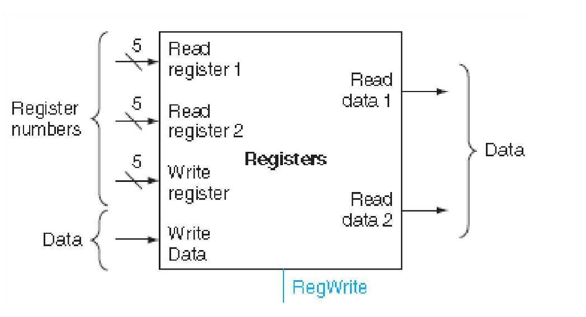
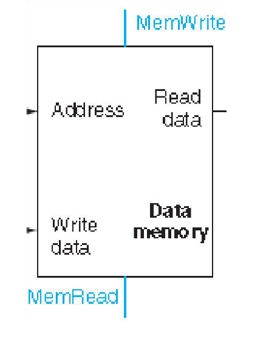
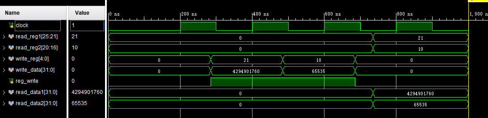
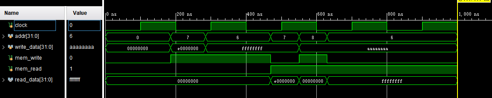
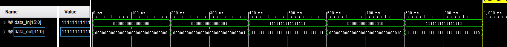

## 计算机系统结构实验Lab4

### 简单的类MIPS单周期处理器实现：寄存器、存储器与有符号扩展

> 姓名：陈文浩
>
> 学号：519030910217

[TOC]

<div STYLE="page-break-after: always;"></div>

### 1.实验目的

理解CPU 的寄存器、存储器、有符号扩展

1. Register 的实现
2. Data Memory 的实现
3. 有符号扩展的实现
4. 使用行为仿真

### 2.原理分析

#### 2.1 寄存器(Register)原理分析

​	寄存器(Register)的功能是暂时存储一些数据以及中间运算结果，其需要同时支持双通道数据读取、数据写入的功能，MIPS处理器有32个32位的寄存器。

​	寄存器的输入输出如下图所示：



​	寄存器的读取操作是组合逻辑，只要遇到readReg1、readReg2中的一个，即可读取。但是对于写寄存器来说，如果在writeReg信号达到高电平之前writeReg没有选中正确的寄存器，或者writeData不是正确的数据，则会发生错误。因此，可以约定采用时钟下降沿作为写操作的同步信号。

#### 2.2 存储器(Data Memory)原理分析

​	数据存储器模块与寄存器模块类似，也需要考虑写数据的同步问题。因此，这里依然统一约定在时钟的下降沿写数据。

​	存储器的输入输出如下图所示：



#### 2.3 有符号扩展单元(Sign Extension)原理分析

​	有符号扩展单元的主要功能是将指令中的16位有符号立即数拓展为32位有符号立即数，因此只需要将这个16位有符号数的符号位填充在32位有符号立即数的高16位，再将低16位复制到32位有符号立即数的低16位即可。

### 3.功能实现

​	完整的代码详见"工程文件"目录的lab4。

#### 3.1 寄存器(Register)功能实现

​	寄存器内部所有的值均初始化为0。约定下降沿写入数据，而读取会在read_reg1、read_reg2或者reg_write改变后重新触发，这也就保证了在写完数据后(reg_write重新置为0时)，读取的数据会更新。

```verilog
// 32 registers
reg [31: 0] reg_file[31: 0];

// read
// update when reg_write 1->0
always @(read_reg1 or read_reg2
             or reg_write) begin

    read_data1 = reg_file[read_reg1];
    read_data2 = reg_file[read_reg2];

end

// write
always @(negedge clk) begin
    if (reg_write)
        reg_file[write_reg] = write_data;
end

initial begin: regInit
    integer i;
    for (i = 0 ; i < 32 ; i = i + 1)
        reg_file[i] = 0;
    read_data1 = 0;
    read_data2 = 0;
end
```


#### 3.2 存储器(Data Memory)功能实现

​	存储器内部所有的值均初始化为0。约定下降沿写入数据，而读取会在mem_read、addr或者mem_write改变后重新触发，这也就保证了在写完数据后(mem_write重新置为0时)，读取的数据会更新。

```verilog
reg [31: 0] mem_file[63: 0];

// read
// update when mem_write 1->0
always @(addr or mem_read
             or mem_write) begin
    if (mem_read)
        read_data = mem_file[addr];
end

// write
always @(negedge clk) begin
    if (mem_write)
        mem_file[addr] = write_data;
end

initial begin: dataInit
    integer i;
    for (i = 0 ; i < 64 ; i = i + 1)
        mem_file[i] = 0;
    read_data = 0;
end
```


#### 3.3 有符号扩展单元(Sign Extension)功能实现

​	将指令中的16位有符号立即数拓展为32位有符号立即数，只需要将这个16位有符号数的符号位填充在32位有符号立即数的高16位，再将低16位复制到32位有符号立即数的低16位即可。因此，可以使用拼接操作。

```verilog
assign data_out = data_in[15] ?
       {16'hffff, data_in} : {16'h0000, data_in};
```

### 4.结果验证

​	完整的激励文件详见"工程文件"目录的lab4。

#### 4.1 寄存器(Register)结果验证

​	编写如下激励文件

```verilog
initial begin
    // initial
    clock = 0;
    read_reg1 = 0;
    read_reg2 = 0;
    write_reg = 0;
    write_data = 0;
    reg_write = 0;
    #100;
    clock = 0;

    #185;   // 285ns
    reg_write = 1;
    write_reg = 5'b10101;
    write_data = 32'hffff0000;

    #200;   // 485ns
    write_reg = 5'b01010;
    write_data = 32'h0000ffff;

    #200;   // 685ns
    reg_write = 0;
    write_reg = 5'b00000;
    write_data = 0;

    #50;    // 735ns
    read_reg1 = 5'b10101;
    read_reg2 = 5'b01010;
end
```

​	可以得到如下仿真结果，由于加入了初始化，并没有出现x，与指导书所示的正确结果相符




#### 4.2 存储器(Data Memory)结果验证

​	编写如下激励文件

```verilog
initial begin
    clock = 0;
    mem_write = 0;
    mem_read = 0;
    write_data = 0;
    addr = 0;

    #185;   // 185ns
    mem_write = 1;
    addr = 7;
    write_data = 32'he0000000;

    #100;   // 285ns
    mem_write = 1;
    write_data = 32'hffffffff;
    addr = 6;

    #185;   // 470ns
    addr = 7;
    mem_read = 1;
    mem_write = 0;

    #80;    // 550ns
    mem_write = 1;
    addr = 8;
    write_data = 32'haaaaaaaa;

    #80;    // 630ns
    mem_write = 0;
    mem_read = 1;
    addr = 6;

end
```

​	可以得到如下仿真结果，由于加入了初始化，并没有出现x，与指导书所示的正确结果相符




#### 4.3 有符号扩展单元(Sign Extension)结果验证

​	编写如下激励文件

```verilog
initial begin
    data_in = 16'h0000;

    #200;
    data_in = 1;

    #200;
    data_in = 16'hffff;

    #200;
    data_in = 2;

    #200;
    data_in = 16'hfffe;
end
```

​	可以得到如下仿真结果，与指导书所示的正确结果相符



### 5.总结与感谢

​	这次实验我实现了寄存器(Register)、存储器(Data Memory)、有符号扩展单元(Sign Extension)三个模块，它们是MIPS处理器的重要组成部分。此外，此次实验也提升了我编写verilog代码的能力，提升了我对编写代码模块化的思想，使得我在后面的代码编写时更加得心应手。在本次实验中，使用时钟下降沿来同步操作也是一个非常重要的思想，值得我深入研究。

​	感谢计算机科学与工程系相关老师对于课程指导书的编写，对于课程的设计以及提供的实验环境。

