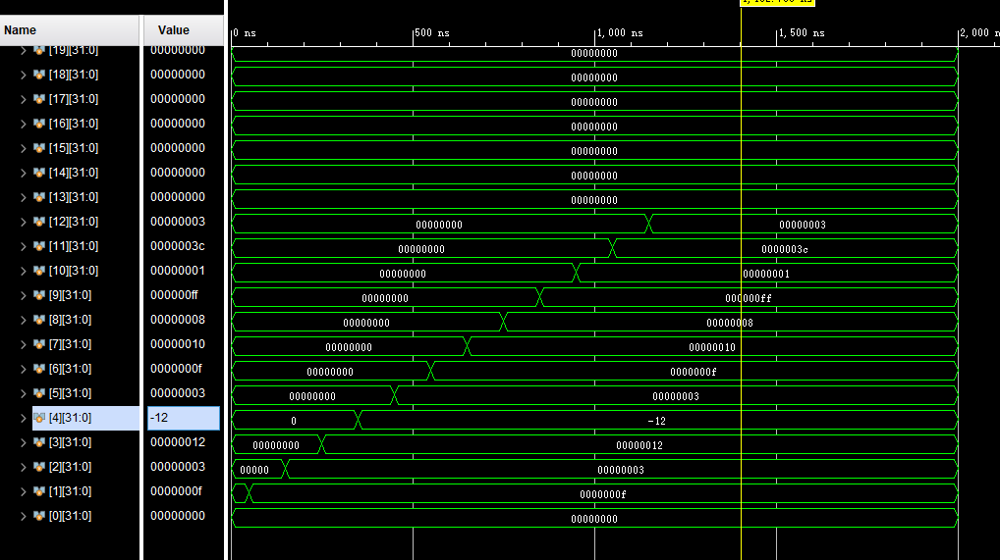
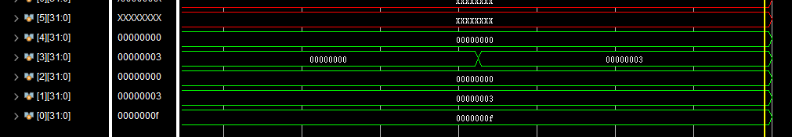
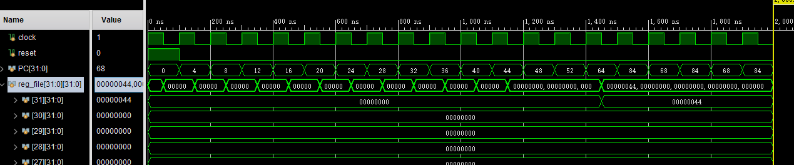

## 计算机系统结构实验Lab5

### 类MIPS 单周期处理器的设计与实现

> 姓名：陈文浩
>
> 学号：519030910217

[TOC]

<div STYLE="page-break-after: always;"></div>

### 1.实验目的

​	完成单周期的类MIPS 处理器，支持16 条MIPS 指令（包括R型指令中的add、sub、and、or、slt、sll、srl、jr；I型指令中的lw、sw、addi、ori、beq；J型指令中的j、jal）

### 2.指令分析

​	此次实验相比于前几次实验加入了更多的指令，故在此分析了新增指令的通路。

#### 2.1 ANDI/ORI指令

​	ANDI和ORI为R型指令，不同于ADDI指令，这两条指令需要立即数进行零扩展。因此，相比于原来的符号扩展单元，新的扩展单元引入了ext_type来识别扩展的类型。

#### 2.2 SLL/SRL指令

​	SLL和SRL指令为R型指令，但使用了shamt作为ALU的input1。因此，需要增加shamt到ALU的线路，此外，ALU也需要支持位移运算。

​	可以下图中更为清楚地看到：


#### 2.3 JAL指令

​	JAL指令将PC+4的值存入\$ra寄存器，一般用来进行函数的调用。为了支持该指令，需要增加\$ra到write_reg的线路，以及将PC+4写入寄存器的线路以及数据选择器。

​	可以下图中更为清楚地看到：


#### 2.4 JR指令

​	JR指令跳转到\$ra寄存器值的地址，一般用来进行函数的返回。为了支持该指令，需要增加read_data1到PC的线路以及数据选择器。

​	可以下图中更为清楚地看到：


### 3.原理分析

​	寄存器(Register)和存储器(Data Memory)沿用了lab4中实现的模块，故在此不再赘述其原理。

#### 3.1 算术逻辑运算单元(ALU)原理分析

​	ALU主要根据控制信号alu_ctr，对输入的两个数执行对应的算术逻辑运算，输出运算的结果以及部分控制信号。由于指令条数的增加，原先的alu_ctr编码格式不能够完全覆盖到所有ALU需要进行的操作。因此，我对alu_ctr的编码进行了补充，并删除了没有被使用了逻辑或非。如下表所示：

| alu_ctr | 运算类型 |
| :------ | -------- |
| 0000    | 逻辑与   |
| 0001    | 逻辑或   |
| 0010    | 加法     |
| 0110    | 减法     |
| 0011    | 左移     |
| 0100    | 右移     |
| 0111    | 小于置1  |

#### 3.2 主控制器(Ctr)原理分析

​	由于指令条数的增加，在主控制器(Ctr)中根据指令的opcode难以直接解码，需要在ALUCtr根据funct继续生成一些跳转等的控制信号。然而，这似乎已经偏离了ALUCtr名字的含义，ALUCtr已经变得和Ctr一样需要产生多样的控制信号。因此，我<u>将ALUCtr并入了主控制器(Ctr)</u>，在Ctr中同时传入opcode和funct以对指令进行完全解码，并且直接对ALU产生控制信号。此外，在实现Ctr时，我先将所有的信号置0，不会产生任何写入操作，以便处理nop指令。

​	信号的功能如下表所示：

| 信号        | 说明                                              |
| ----------- | ------------------------------------------------- |
| reg_dst_mux | 目标寄存器选择（0：写入rt；1：写入rd）            |
| reg_ra_mux  | 目标寄存器选择（1：写入$ra)                       |
| alu_src_mux | ALU第二个操作数来源（0：reg[rt]；1：立即数）      |
| shamt_mux   | ALU第一个操作数来源（0：reg[ts]；1：shamt）       |
| res_out_mux | 写寄存器的数据来源（0：ALU结果；1：内存读取结果） |
| reg_write   | 寄存器写使能信号                                  |
| mem_read    | 内存读使能信号                                    |
| mem_write   | 内存写使能信号                                    |
| branch_mux  | 条件跳转信号                                      |
| jump_mux    | 无条件跳转信号                                    |
| pc_reg_mux  | PC+4写入寄存器（JAL指令使用）                     |
| reg_pc_mux  | 寄存器读取结果写入PC（JR指令使用）                |
| ext_type    | 立即数扩展的类型（0：符号扩展，1：零扩展）        |
| alu_ctr     | ALU控制信号                                       |

​	部分新增指令产生的信号如下（完整信号请参考代码）：

|             | ANDI         | SLL        | JAL          | JR           |
| ----------- | ------------ | ---------- | ------------ | ------------ |
| reg_dst_mux | 0            | 1          | 0            | 0            |
| reg_ra_mux  | 0            | 0          | 1            | 0            |
| alu_src_mux | 1            | 0          | 0            | 0            |
| shamt_mux   | 0            | 1          | 0            | 0            |
| res_out_mux | 0            | 0          | 0            | 0            |
| reg_write   | 1            | 1          | 1            | 0            |
| mem_read    | 0            | 0          | 0            | 0            |
| mem_write   | 0            | 0          | 0            | 0            |
| branch_mux  | 0            | 0          | 0            | 0            |
| jump_mux    | 0            | 0          | 1            | 0            |
| pc_reg_mux  | 0            | 0          | 1            | 0            |
| reg_pc_mux  | 0            | 0          | 0            | 1            |
| ext_type    | 1            | 0          | 0            | 0            |
| alu_ctr     | 0000(逻辑与) | 0011(左移) | 0000(不需要) | 0000(不需要) |

#### 3.3 指令存储器(Instruction Memory)原理分析

​	指令存储器(Instruction Memory)用于根据PC的值读取指令，其实现和存储器类似，且不需要支持修改操作。

#### 3.4 扩展单元(Extension)原理分析

​	由于需要支持立即数的零扩展，扩展单元(Extension)引入了ext_type的信号来识别扩展的类型。

#### 3.5 数据选择器(Mux)原理分析

​	数据选择器的主要原理是根据指定信号，选择两个输入数据通路的其中对应的一个输出。由于需要支持不同宽度的数据选择，共有两种数据选择器，一种的输入输出均为5位数据通路，一种输入输出均为32位数据通路。

#### 3.6 顶层模块(Top)原理分析

​	顶层模块将所有的模块实例化并进行连线，电路图如下所示：


### 4.功能实现

​	完整的代码详见"工程文件"目录的lab5。寄存器(Register)和存储器(Data Memory)沿用了lab4中实现的模块，故在此不再赘述其功能。

#### 4.1 算术逻辑运算单元(ALU)功能实现

​	ALU新增了左移和右移的操作。

```verilog
always @({input1, input2, alu_ctr}) begin
    // $stop;
    case (alu_ctr)
        4'b0000:
            alu_res = input1 & input2;  // and
        4'b0001:
            alu_res = input1 | input2;  // or
        4'b0010:
            alu_res = input1 + input2;  // add
        4'b0110:
            alu_res = input1 - input2;  // sub
        4'b0011:
            alu_res = input2 << input1; // <<
        4'b0100:
            alu_res = input2 >> input1; // >>
        4'b0111:
            // set on less than
            alu_res = ($signed(input1) < $signed(input2));
        default: begin
            // $stop;
            alu_res = 0;
        end
    endcase
    zero = (alu_res == 0);
end
```

#### 4.2 主控制器(Ctr)功能实现

​	Ctr中同时传入opcode和funct以对指令进行完全解码，并且直接对ALU产生控制信号。此外，Ctr先将所有的信号置0，不会产生任何写入操作，以便处理nop指令。

```verilog
always @(op_code or funct) begin
    // debug
    // $stop;

    // clear
    reg_dst_mux = 0; // rt
    reg_ra_mux = 0; // write to $ra?
    alu_src_mux = 0; // reg
    res_out_mux = 0; // alu res
    reg_write = 0;
    mem_read = 0;
    mem_write = 0;
    branch_mux = 0;
    jump_mux = 0;
    shamt_mux = 0; // imm
    pc_reg_mux = 0; // pc not to reg
    reg_pc_mux = 0; // reg not to pc
    ext_type = 0; // zero extend


    case (op_code)
        // add, sub, and, or, slt, jr, sll, srl
        6'b000000: begin
            case (funct)
                // add
                6'b100000: begin
                    reg_dst_mux = 1;
                    reg_write = 1;
                    alu_ctr = 4'b0010; // add
                end
                // sub
                6'b100010: begin
                    reg_dst_mux = 1;
                    reg_write = 1;
                    alu_ctr = 4'b0110; // sub
                end
                // and
                6'b100100: begin
                    reg_dst_mux = 1;
                    reg_write = 1;
                    alu_ctr = 4'b0000; // and
                end
                // or
                6'b100101: begin
                    reg_dst_mux = 1;
                    reg_write = 1;
                    alu_ctr = 4'b0001; // or
                end
                // slt
                6'b101010: begin
                    reg_dst_mux = 1;
                    reg_write = 1;
                    alu_ctr = 4'b0111; // slt
                end
                // jr
                6'b001000: begin
                    reg_pc_mux = 1;
                end
                // sll
                6'b000000: begin
                    // $stop;
                    reg_dst_mux = 1;
                    shamt_mux = 1;
                    reg_write = 1;
                    alu_ctr = 4'b0011; // <<
                end
                // srl
                6'b000010: begin
                    // $stop;
                    reg_dst_mux = 1;
                    shamt_mux = 1;
                    reg_write = 1;
                    alu_ctr = 4'b0100; // >>
                end
                default:
                    $stop;
            endcase
        end
        6'b100011: begin    // lw
            alu_src_mux = 1;
            res_out_mux = 1;
            reg_write = 1;
            mem_read = 1;
            alu_ctr = 4'b0010; // add
        end
        6'b101011: begin    // sw
            alu_src_mux = 1;
            mem_write = 1;
            alu_ctr = 4'b0010; // add
        end
        6'b000100: begin    // beq
            branch_mux = 1;
            alu_ctr = 4'b0110; // sub
        end
        6'b000010: begin    // j
            jump_mux = 1;
        end
        6'b000011: begin    // jal
            reg_ra_mux = 1; // write to $ra
            reg_write = 1;
            pc_reg_mux = 1;
            jump_mux = 1;
        end
        6'b001000: begin    // addi
            alu_src_mux = 1;
            reg_write = 1;
            alu_ctr = 4'b0010; // add
        end
        6'b001100: begin    // andi
            alu_src_mux = 1;
            reg_write = 1;
            ext_type = 1;
            alu_ctr = 4'b0000; // and
        end
        6'b001101: begin    // ori
            alu_src_mux = 1;
            reg_write = 1;
            ext_type = 1;
            alu_ctr = 4'b0001; // or
        end
        default:
            $stop;
    endcase
end
```

#### 4.3 指令存储器(Instruction Memory)功能实现

​	注意每条指令有4个字节，因此将addr/4作为索引。

```verilog
always @(addr) begin
    inst = inst_file[addr >> 2];
end
```

#### 4.4 扩展单元(Extension)功能实现

​	使用ext_type区分符号扩展和零扩展。

```verilog
assign data_out = (ext_type & data_in[15]) ?
       {16'hffff, data_in} : {16'h0000, data_in};
```

#### 4.5 数据选择器(Mux)功能实现

​	以Mux32为例，和Mux5仅有位宽的差别。Mux根据ctr选择input0或者input1。

```verilog
always @(input1 or input0
             or ctr) begin
    data_out = ctr ? input1 : input0;
end
```

#### 4.6 顶层模块(Top)功能实现

​	顶层模块实例化每个模块并用线路连接。此处，为了区分连线，每一根数据线均用全大写字母并和Ctr中信号一致。此外，我没有将PC放入模块，而是直接定义在了Top里，并在每个时钟上升沿更新PC（时钟下降沿已经用于写入操作）。

```verilog
reg [31: 0] PC;
wire [31: 0] INST;

// load instruction from mem
InstMemory inst_mem(.addr(PC), .inst(INST));

wire [3: 0] ALU_CTR;
wire REG_DST_MUX, ALU_SRC_MUX, RES_OUT_MUX;
wire REG_WRITE, MEM_RAED, MEM_WRITE, BRANCH_MUX;
wire JUMP_MUX, SHAMT_MUX, REG_RA_MUX;
wire PC_REG_MUX, REG_PC_MUX, EXT_TYPE;

// main controller
Ctr controller(
        .op_code(INST[31: 26]),
        .funct(INST[5: 0]),
        .reg_dst_mux(REG_DST_MUX),
        .reg_ra_mux(REG_RA_MUX),
        .alu_src_mux(ALU_SRC_MUX),
        .res_out_mux(RES_OUT_MUX),
        .reg_write(REG_WRITE),
        .mem_read(MEM_READ),
        .mem_write(MEM_WRITE),
        .branch_mux(BRANCH_MUX),
        .jump_mux(JUMP_MUX),
        .shamt_mux(SHAMT_MUX),
        .pc_reg_mux(PC_REG_MUX),
        .reg_pc_mux(REG_PC_MUX),
        .ext_type(EXT_TYPE),
        .alu_ctr(ALU_CTR));

wire [4: 0] INST_OUT, WRITE_REG_ADDR;
wire [31: 0] READ_REG_1, READ_REG_2, REG_WRITE_DATA;

// register dst
Mux5 write_reg_mux(
         .ctr(REG_DST_MUX),
         .input1(INST[15: 11]),
         .input0(INST[20: 16]),
         .data_out(INST_OUT));
// write to $ra? (newly added)
Mux5 reg_ra_mux(
         .ctr(REG_RA_MUX),
         .input1(5'b11111),
         .input0(INST_OUT),
         .data_out(WRITE_REG_ADDR));

// register file
Registers regs(
              .clk(clk),
              .reset(reset),
              .read_reg1(INST[25: 21]),
              .read_reg2(INST[20: 16]),
              .write_reg(WRITE_REG_ADDR),
              .write_data(REG_WRITE_DATA),
              .reg_write(REG_WRITE),
              .read_data1(READ_REG_1),
              .read_data2(READ_REG_2));


wire [31: 0] IMM_OUT, ALU_MUX_SRC1;
wire [31: 0] ALU_MUX_SRC2, ALU_RESULT;
wire ZERO;

// imm extend
Extend ext(
           .ext_type(EXT_TYPE),
           .data_in(INST[15: 0]),
           .data_out(IMM_OUT));
// alu mux32
Mux32 alu_src_mux(
          .ctr(ALU_SRC_MUX),
          .input1(IMM_OUT),
          .input0(READ_REG_2),
          .data_out(ALU_MUX_SRC2));
// shamt mux (0: reg_1, 1: shamt) (newly added)
Mux32 shamt_mux(
          .ctr(SHAMT_MUX),
          .input1({27'b0, INST[10: 6]}),
          .input0(READ_REG_1),
          .data_out(ALU_MUX_SRC1));
// ALU
ALU alu(
        .input1(ALU_MUX_SRC1),
        .input2(ALU_MUX_SRC2),
        .alu_ctr(ALU_CTR),
        .zero(ZERO),
        .alu_res(ALU_RESULT));

// data memory
wire [31: 0] MEM_READ_DATA;
DataMemory data_mem(
               .clk(clk),
               .addr(ALU_RESULT),
               .write_data(READ_REG_2),
               .mem_write(MEM_WRITE),
               .mem_read(MEM_READ),
               .read_data(MEM_READ_DATA));

wire [31: 0] RES_OUT;
wire [31: 0] PC4;
wire [31: 0] BRANCH_ADDR, BRANCH_OUT;
wire [31: 0] JUMP_ADDR, JUMP_OUT, NEXT_PC;
assign PC4 = PC + 4;
// jump address
assign JUMP_ADDR = {PC4[31: 28], INST[25: 0] << 2};
// branch address
assign BRANCH_ADDR = PC4 + (IMM_OUT << 2);
// result mux
Mux32 res_out_mux(
          .ctr(RES_OUT_MUX),
          .input1(MEM_READ_DATA),
          .input0(ALU_RESULT),
          .data_out(RES_OUT));
// pc to reg mux (jal) (newly added)
Mux32 reg_write_mux(
          .ctr(PC_REG_MUX),
          .input1(PC4),
          .input0(RES_OUT),
          .data_out(REG_WRITE_DATA));
// branch mux
Mux32 branch_mux(
          .ctr(BRANCH_MUX & ZERO),
          .input1(BRANCH_ADDR),
          .input0(PC4),
          .data_out(BRANCH_OUT));
// jump mux
Mux32 jump_mux(
          .ctr(JUMP_MUX),
          .input1(JUMP_ADDR),
          .input0(BRANCH_OUT),
          .data_out(JUMP_OUT));
// pc mux (jr) (newly added)
Mux32 pc_mux(
          .ctr(REG_PC_MUX),
          .input1(READ_REG_1),
          .input0(JUMP_OUT),
          .data_out(NEXT_PC));

// update PC
always @ (posedge clk) begin
    // debug
    // $stop;

    if (reset)
        PC = 0;
    else
        PC = NEXT_PC;
end
```

### 5.结果验证

​	激励文件使用readmemh指令，结合绝对路径，分别读入了内存和指令。其中，载入的内存文件如下：

```text
0000000f
00000003
00000000
00000000
00000000
```

载入的汇编代码如下：

```assembly
lw      $1 0x0 $zero
lw      $2 0x1 $zero
add     $3,$1,$2
sub     $4,$2,$1
and     $5,$1,$2
or      $6,$1,$2
addi    $7,$1,0x1
andi    $8,$1,0x8
ori     $9,$1,0xf3
slt     $10,$2,$1
sll     $11,$1,0x2
srl     $12,$1,0x2
sw      $12 0x3 $zero 
beq     $1,$1,0x2       # to jal
nop
nop
jal     0x15            # to jr
j       0x15            # to jr
nop
nop
nop
jr      $ra             # to j
```

该程序首先从内存载入\$1、\$2的值，测试所有的运算指令并分别存入不同的寄存器。以下表格对运算指令的结果进行说明：

| 目标寄存器 | 结果             |      |
| ---------- | ---------------- | ---- |
| $3         | 0xf+0x3=0x12     |      |
| $4         | 0x3-0xf=-12      |      |
| $5         | 0x3&0xf=0x3      |      |
| $6         | 0x3\|0xf=0xf     |      |
| $7         | 0xf+0x1=0x10     |      |
| $8         | 0xf&0x8=0x8      |      |
| $9         | 0xf\|0xf3=0xff   |      |
| $10        | 0x3<0xf => set 1 |      |
| $11        | 0xf<<2=0x3c      |      |
| $12        | 0xf>>2=0x3       |      |

和下图的仿真结果一致：



此外，sw的效果如下所示：



​	在测试完运算指令后，会进行一系列跳转的测试，并最后在J和JR指令间形成循环。运算指令的结果如下所示：



可以看到PC在52的beq指令处开始跳转，跳转至64的JAL指令。JAL指令跳转至84的JR指令，并将下一条指令的地址0x44=68写入\$ra寄存器。JR指令跳转到68的J指令，而J指令继续跳转至JR，在68和84之间形成循环。

### 6.总结与感谢

​	这次实验我实现了能够运行16条指令的MIPS处理器。此次实验也极大提升了我编写verilog代码的能力。在本次实验中，我有幸能够将系统结构理论上学习到的单周期处理器变成现实，这让我对MIPS处理器的部件，信号通路以及不同的指令有了更深的理解。

​	与此同时，该次实验也让我体会到了设计比实现更加重要。在刚开始实验时，我没有绘制信号通路，而是直接开始，这让我遇到了很多挫折。在遇到挫折后，我觉得我应该先明确设计思路，因此，我完整地绘制了每一条指令的通路以及整个CPU的线路图，这让我在之后编写代码时有了清晰的思路，极大地减少了我代码中的错误并加快了编写地速度。

​	感谢计算机科学与工程系相关老师对于课程指导书的编写，对于课程的设计以及提供的实验环境。