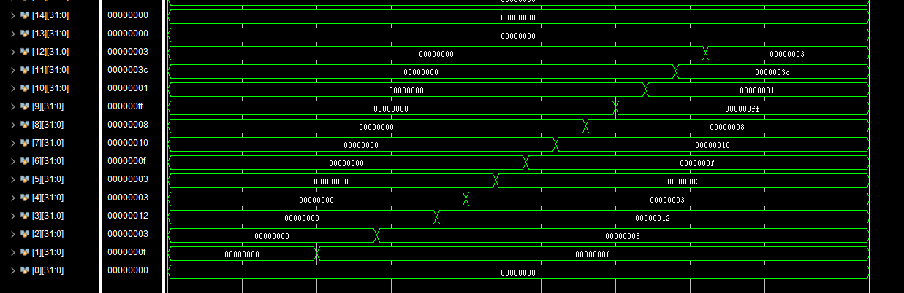

## 计算机系统结构实验Lab6

### 简单的类 MIPS 多周期流水化处理器实现

> 姓名：陈文浩
>
> 学号：519030910217

### 摘要

​	本次实验在单周期类MIPS处理器的基础上，实现了类MIPS多周期流水线处理器。该流水处理器<u>支持16条指令</u>，并且支持<u>流水线停顿(stall)</u>来解决流水线冒险，同时，该处理器也支持<u>前向通路(forwarding)</u>以减少停顿周期，支持<u>预测不转移(predict-not-taken)策略</u>以减少控制冒险的停顿。

[TOC]

<div STYLE="page-break-after: always;"></div>


### 1.实验目的

1. 理解CPU Pipeline，了解流水线冒险(hazard)及相关性，设计基础流水线CPU
2. 设计支持Stall的流水线CPU。通过检测竞争并插入停顿(Stall)机制解决数据冒险、控制竞争和结构冒险
3. 在2的基础上，增加Forwarding机制解决数据竞争，减少因数据竞争带来的流水线停顿延时，提高流水线处理器性能（也允许将Stall与Forwarding结合实现）
4. 在3的基础上，通过predict-not-taken或延时转移策略解决控制冒险/竞争，减少控制竞争带来的流水线停顿延时，进一步提高处理器性能（也允许将2、3、4结合实现）

### 2.原理分析

#### 2.1 模块原理分析

​	由于没有扩展指令集的大小，所有的模块均沿用了Lab5的模块，故在此不再赘述其原理。

#### 2.2 流水线各阶段分析

##### 2.2.1 取指阶段(Instruction Fetch, IF)

​	在取指阶段，首先根据jump_mux,branch_mux以及reg_pc_mux信号，以及branch地址、jump地址以及寄存器读取结构来计算出NEXT_PC，也就是PC的下一个位置。与此同时，根据PC从指令存储器中取出当前指令。

##### 2.2.2 译码阶段(Instruction Decode, ID)

​	译码阶段主要包含主控制器模块(Ctr)、寄存器模块(Registers)、扩展单元(Extension)以及计算寄存器写入地址的两个Mux。该阶段主要根据指令译码得到各控制信号，同时进行相应的立即数扩展、寄存器写入地址的计算以及jump跳转地址的计算。

##### 2.2.3 执行阶段(Execution, EXE)

​	执行阶段主要包括算术逻辑运算单元(ALU)以及一系列对于运算数的选择器。该阶段首先根据控制信号，选出相应的运算数，并在算数逻辑运算单元执行指令中对应的运算，同时也计算出branch跳转地址。

##### 2.2.4 访存阶段(Memory Access, MEM)

​	访存阶段主要包括存储器(Data Memory)，主要原理是进行内存的读/写访问。

##### 2.2.5 写回阶段(Write Back, WB)

​	写回阶段主要包括对寄存器的写回，根据控制信号选择最终的写入寄存器的内容，并写入目标寄存器地址处。

#### 2.2 顶层模块(Top)原理分析

​	顶层模块总的结构如下图所示：


##### 2.2.1 流水阶段间寄存器

​	为了在流水线的两个阶段之间保存结果，需要设置一系列的段寄存器，用于传递数据。此外，在段寄存器中，我也引入了reset信号，以便进行初始化和清空的操作，当reset为1时会将段寄存器所有的内容清空。

- IF→ID段寄存器：包含指令以及PC+4
- ID→EXE段寄存器：包含大部分的控制信号（除了立即数扩展，寄存器写入地址选择器的信号）、立即数扩展的结果、rs、rt、shamt，寄存器写入地址、jump跳转的地址以及PC+4
- EXE→MEM段寄存器：包含剩余的控制信号（mem_write、reg_write等信号）、ALU的运算结果、rt寄存器读取的结果，目标寄存器的地址以及branch跳转的地址。
- MEM→WB段寄存器：包含reg_write信号、pc_reg_mux信号、res_out_mux信号以及目标寄存器的地址。

##### 2.2.2 消除结构冒险的原理分析

​	流水线处理器的结构冒险如下图所示：


​	在时钟下降沿写入寄存器消除了该结构冒险。此外，为了确保在写入后读取的结构能够更新，我引入了write_finish信号，并在写入结束后改变该信号以重新触发读取。

##### 2.2.3 流水线前向通路的原理分析

- EXE到下一个EXE阶段

  用于解决use-use冒险

  

- MEM到EXE阶段

  用于解决load-use冒险

  

##### 2.2.4 流水线停顿的原理分析

​	有了前向通路的优化，仅当出现访存-使用冒险才需要流水线的指令停顿1个周期。

##### 2.2.5 转移不预测的原理分析

​	预测不转移用来解决跳转指令带来的控制冒险，当预测错误时，清除(flush)转移指令后的所有指令并转移到正确的地址继续执行。对于非转移，通过转移不预测，可将非转移指令造成的流水线停顿降为零。

### 3.功能实现

​	完整的代码详见"工程文件"目录的lab6。

#### 3.1 模块功能实现

​	由于没有扩展指令集的大小，所有的模块均沿用了Lab5的模块，故在此不再赘述其功能。其中部分略有修改的功能会在3.2中给予说明。

#### 3.2 重要功能实现

##### 3.2.1 流水阶段间寄存器功能实现

​	在段寄存器中引入了reset信号，以便进行初始化和清空的操作，当reset为1时会将段寄存器所有的内容清空。

- IF→ID段寄存器

  ```verilog
  always @(posedge clk) begin
      // $stop;
  
      // do not change ID when stalled
      if (!stall) begin
          if (reset) begin
              PC4_OUT = 0;
              INST_OUT = 0;
          end
          else begin
              PC4_OUT = PC4;
              INST_OUT = INST;
          end
      end
  end
  ```

- ID→EXE段寄存器

  ```verilog
  always @(posedge clk) begin
      // $stop;
  
      if (reset) begin
          PC4_OUT = 0;
          ALU_CTR_OUT = 0;
          ALU_SRC_MUX_OUT = 0;
          SHAMT_MUX_OUT = 0;
          RES_OUT_MUX_OUT = 0;
          REG_WRITE_OUT = 0;
          MEM_READ_OUT = 0;
          MEM_WRITE_OUT = 0;
          BRANCH_MUX_OUT = 0;
          JUMP_MUX_OUT = 0;
          PC_REG_MUX_OUT = 0;
          REG_PC_MUX_OUT = 0;
          JUMP_ADDR_OUT = 0;
          IMM_OUT_OUT = 0;
          SHAMT_OUT = 0;
          WRITE_REG_ADDR_OUT = 0;
          READ_REG_1_OUT = 0;
          READ_REG_2_OUT = 0;
      end
      else begin
          PC4_OUT = PC4;
          ALU_CTR_OUT = ALU_CTR;
          ALU_SRC_MUX_OUT = ALU_SRC_MUX;
          SHAMT_MUX_OUT = SHAMT_MUX;
          RES_OUT_MUX_OUT = RES_OUT_MUX;
          REG_WRITE_OUT = REG_WRITE;
          MEM_READ_OUT = MEM_READ;
          MEM_WRITE_OUT = MEM_WRITE;
          BRANCH_MUX_OUT = BRANCH_MUX;
          JUMP_MUX_OUT = JUMP_MUX;
          PC_REG_MUX_OUT = PC_REG_MUX;
          REG_PC_MUX_OUT = REG_PC_MUX;
          JUMP_ADDR_OUT = JUMP_ADDR;
          IMM_OUT_OUT = IMM_OUT;
          SHAMT_OUT = SHAMT;
          WRITE_REG_ADDR_OUT = WRITE_REG_ADDR;
          READ_REG_1_OUT = READ_REG_1;
          READ_REG_2_OUT = READ_REG_2;
      end
  end
  ```

- EXE→MEM段寄存器

  ```verilog
  always @(posedge clk) begin
      // $stop;
  
      if (reset) begin
          RES_OUT_MUX_OUT = 0;
          REG_WRITE_OUT = 0;
          MEM_READ_OUT = 0;
          MEM_WRITE_OUT = 0;
          BRANCH_MUX_OUT = 0;
          JUMP_MUX_OUT = 0;
          PC_REG_MUX_OUT = 0;
          REG_PC_MUX_OUT = 0;
          JUMP_ADDR_OUT = 0;
          WRITE_REG_ADDR_OUT = 0;
          READ_REG_1_OUT = 0;
          READ_REG_2_OUT = 0;
          ZERO_OUT = 0;
          ALU_RESULT_OUT = 0;
          BRANCH_ADDR_OUT = 0;
          PC4_OUT = 0;
      end
      else begin
          RES_OUT_MUX_OUT = RES_OUT_MUX;
          REG_WRITE_OUT = REG_WRITE;
          MEM_READ_OUT = MEM_READ;
          MEM_WRITE_OUT = MEM_WRITE;
          BRANCH_MUX_OUT = BRANCH_MUX;
          JUMP_MUX_OUT = JUMP_MUX;
          PC_REG_MUX_OUT = PC_REG_MUX;
          REG_PC_MUX_OUT = REG_PC_MUX;
          JUMP_ADDR_OUT = JUMP_ADDR;
          WRITE_REG_ADDR_OUT = WRITE_REG_ADDR;
          READ_REG_1_OUT = READ_REG_1;
          READ_REG_2_OUT = READ_REG_2;
          ZERO_OUT = ZERO;
          ALU_RESULT_OUT = ALU_RESULT;
          BRANCH_ADDR_OUT = BRANCH_ADDR;
          PC4_OUT = PC4;
      end
  end
  ```

- MEM→WB段寄存器

  ```verilog
  always @(posedge clk) begin
      // $stop;
  
      if (reset) begin
          PC4_OUT = 0;
          MEM_READ_DATA_OUT = 0;
          ALU_RESULT_OUT = 0;
          RES_OUT_MUX_OUT = 0;
          PC_REG_MUX_OUT = 0;
          REG_WRITE_OUT = 0;
          WRITE_REG_ADDR_OUT = 0;
      end
      else begin
          PC4_OUT = PC4;
          MEM_READ_DATA_OUT = MEM_READ_DATA;
          ALU_RESULT_OUT = ALU_RESULT;
          RES_OUT_MUX_OUT = RES_OUT_MUX;
          PC_REG_MUX_OUT = PC_REG_MUX;
          REG_WRITE_OUT = REG_WRITE;
          WRITE_REG_ADDR_OUT = WRITE_REG_ADDR;
      end
  end
  ```

  

##### 3.2.2 消除结构冒险的功能实现

​	为了确保在写入后读取的结构能够更新，我引入了write_finish信号，并在写入结束后改变该信号以重新触发读取，以下代码可以更好地说明：

```verilog
// read
always @(read_reg1 or read_reg2
             or reg_write or write_finish) begin

    read_data1 = reg_file[read_reg1];
    read_data2 = reg_file[read_reg2];

end

// write
always @(negedge clk) begin
    if (reg_write) begin
        // $stop;
        reg_file[write_reg] = write_data;
        // trigger
        write_finish = !write_finish;
    end

end
```


##### 3.2.3 流水线前向通路的功能实现

- EXE到下一个EXE阶段

  在EXE阶段完成后用线路连接并传回至ID-EXE寄存器即可达到目的。

  EXE传回的线路如下所示：

  ```verilog
  // forwarding addr and data
  // to next EXE
  // $zero is always 0
  Mux5 for_exe_reg_addr(.ctr(!EXE_RES_OUT_MUX
                             & EXE_REG_WRITE),
                        .input1(EXE_WRITE_REG_ADDR),
                        .input0(5'b0),
                        .data_out(FOR_EXE_WRITE_REG_ADDR));
  Mux32 for_exe_reg_data(.ctr(!EXE_RES_OUT_MUX
                              & EXE_REG_WRITE),
                         .input1(EXE_ALU_RESULT),
                         .input0(32'b0),
                         .data_out(FOR_EXE_REG_WRITE_DATA));
  ```

  同时，增加了数据选择器判断是否使用forwarding的数据，若接受forwarding的数据，则将新的数据作为寄存器读取结果传入ID-EXE寄存器，如下所示：

  ```verilog
  Mux32 for_exe_data_1(.ctr(FOR_EXE_WRITE_REG_ADDR
                            == ID_INST[25: 21]),
                       .input1(FOR_EXE_REG_WRITE_DATA),
                       .input0(READ_REG_1),
                       .data_out(FOR_REG_1));
  
  Mux32 for_exe_data_2(.ctr(FOR_EXE_WRITE_REG_ADDR
                            == ID_INST[20: 16]),
                       .input1(FOR_EXE_REG_WRITE_DATA),
                       .input0(READ_REG_2),
                       .data_out(FOR_REG_2));
  ```

- MEM到EXE阶段

  在MEM阶段完成后用线路连接并传回至ID-EXE寄存器即可达到目的。

  MEM传回的线路如下所示（Mux的名字与上述的第一种不同）：

  ```verilog
  // forwarding addr and data
  // to next EXE
  // $zero is always 0
  Mux5 for_mem_reg_addr(.ctr(MEM_RES_OUT_MUX
                             & MEM_REG_WRITE),
                        .input1(MEM_WRITE_REG_ADDR),
                        .input0(5'b0),
                        .data_out(FOR_MEM_WRITE_REG_ADDR));
  Mux32 for_mem_reg_data(.ctr(MEM_RES_OUT_MUX
                              & MEM_REG_WRITE),
                         .input1(MEM_MEM_READ_DATA),
                         .input0(32'b0),
                         .data_out(FOR_MEM_REG_WRITE_DATA));
  ```

  同时，增加了数据选择器判断是否使用forwarding的数据，若接受forwarding的数据，则将新的数据作为寄存器读取结果传入ID-EXE寄存器，如下所示：

  ```verilog
  Mux32 for_mem_data_1(.ctr(FOR_MEM_WRITE_REG_ADDR
                            == ID_INST[25: 21]),
                       .input1(FOR_MEM_REG_WRITE_DATA),
                       .input0(FOR_REG_1),
                       .data_out(ID_READ_REG_1));
  
  Mux32 for_mem_data_2(.ctr(FOR_MEM_WRITE_REG_ADDR
                            == ID_INST[20: 16]),
                       .input1(FOR_MEM_REG_WRITE_DATA),
                       .input0(FOR_REG_2),
                       .data_out(ID_READ_REG_2));
  ```

  

##### 3.2.4 流水线停顿的功能实现

​	停顿信号由Ctr模块检测并输出。有了前向通路的优化，只有load-use停顿一种模式。在这种停顿模式下，下一条指令会在ID阶段停留一个周期，只需保证IF-ID寄存器和ID-EXE寄存器不传递数据即可达到目的。为了结构上的统一，我将STALL--也放在了Ctr里，Ctr在译码时会先检测STALL信号，若不为0则将STALL--并跳过译码。

​	STALL_OUT是Ctr输出的需要停顿的周期数，会在时钟上升沿更新到STALL：

```verilog
always @(posedge clk) begin
    // debug
    // $stop;
    FLUSH <= 0;
    STALL <= STALL_OUT;

    if (reset)
        PC <= 0;
    else begin
        if (STALL == 0)
            PC <= NEXT_PC;
    end
end
```

​	当停顿时，IF-ID寄存器不会传递数据

```verilog
always @(posedge clk) begin
    // $stop;

    // do not change ID when stalled
    if (!stall) begin
        if (reset) begin
            PC4_OUT = 0;
            INST_OUT = 0;
        end
        else begin
            PC4_OUT = PC4;
            INST_OUT = INST;
        end
    end
end
```

​	ID-EXE寄存器直接将数据清空可以达到同样的效果：

```verilog
ID_EXE id_exe(
           .reset(reset | FLUSH
                  | (STALL != 0)),
           ............
```


##### 3.2.5 转移不预测的功能实现

​	PC一直预测的是不跳转，因此，当实际上产生跳转时需要清空跳转指令后续的所有指令，检测并产生清空信号的代码如下（Top的一部分）：

```verilog
always @((IF_BRANCH_MUX & IF_ZERO)
             or IF_JUMP_MUX
             or IF_REG_PC_MUX) begin
    // may jump

    if ((IF_BRANCH_MUX & IF_ZERO)
            | IF_JUMP_MUX
            | IF_REG_PC_MUX) begin
        $stop;
        FLUSH <= 1;
        STALL <= 0;
    end
end
```

这里使用FLUSH信号来清空指令，由于段寄存器支持reset操作，故将reset|FLUSH作为reset信号即可，以下代码可以更好的说明：

```verilog
IF_ID if_id(
          .reset(reset | FLUSH),
          .stall(STALL),
          .clk(clk),
          .INST(IF_INST),
          .PC4(IF_PC4),

          .INST_OUT(ID_INST),
          .PC4_OUT(ID_PC4));
```

FLUSH信号会在每个时钟周期自动清空。


##### 3.2.6 顶层模块(Top)功能实现

​	为了区分每个阶段的线路，我将所有段内的线路均以段缩写开头，例如将ID阶段的alu_src_mux信号命名为ID_ALU_CTR。

​	顶层模块将所有的模块组合起来，代码如下：

```verilog
// stage in and out wire with prefix
// stage intermedia without prefix
module Top(
           input reset,
           input clk
       );

// ---------> IF begin
// solve control hazard
reg FLUSH;
// solve data hazard
reg [2: 0] STALL = 0; // dec in Ctr
wire [2: 0] STALL_OUT; // stall out from Ctr

wire IF_BRANCH_MUX, IF_ZERO;
wire IF_REG_PC_MUX, IF_JUMP_MUX;
wire [31: 0] IF_JUMP_ADDR, IF_BRANCH_ADDR, IF_READ_REG_1;

reg [31: 0] PC;
wire [31: 0] IF_PC4, NEXT_PC, IF_INST;
wire [31: 0] BRANCH_OUT, JUMP_OUT;
assign IF_PC4 = PC + 4;

always @((IF_BRANCH_MUX & IF_ZERO)
             or IF_JUMP_MUX
             or IF_REG_PC_MUX) begin
    // may jump

    if ((IF_BRANCH_MUX & IF_ZERO)
            | IF_JUMP_MUX
            | IF_REG_PC_MUX) begin
        $stop;
        FLUSH <= 1;
        STALL <= 0;
    end
end

// branch mux
Mux32 branch_mux(
          .ctr(IF_BRANCH_MUX & IF_ZERO),
          .input1(IF_BRANCH_ADDR),
          .input0(IF_PC4),
          .data_out(BRANCH_OUT));
// jump mux
Mux32 jump_mux(
          .ctr(IF_JUMP_MUX),
          .input1(IF_JUMP_ADDR),
          .input0(BRANCH_OUT),
          .data_out(JUMP_OUT));
// pc mux (jr)
Mux32 pc_mux(
          .ctr(IF_REG_PC_MUX),
          .input1(IF_READ_REG_1),
          .input0(JUMP_OUT),
          .data_out(NEXT_PC));

// load instruction
InstMemory inst_mem(.addr(PC), .inst(IF_INST));

always @(posedge clk) begin
    // debug
    // $stop;
    FLUSH <= 0;
    STALL <= STALL_OUT;

    if (reset)
        PC <= 0;
    else begin
        if (STALL == 0)
            PC <= NEXT_PC;
    end

end
// <--------- IF end
wire [31: 0] ID_PC4, ID_INST;
IF_ID if_id(
          .reset(reset | FLUSH),
          .stall(STALL),
          .clk(clk),
          .INST(IF_INST),
          .PC4(IF_PC4),

          .INST_OUT(ID_INST),
          .PC4_OUT(ID_PC4));

// ---------> ID begin
wire [3: 0] ID_ALU_CTR;
wire ID_ALU_SRC_MUX, ID_SHAMT_MUX;
wire ID_RES_OUT_MUX, ID_REG_WRITE;
wire ID_MEM_READ, ID_MEM_WRITE;
wire ID_BRANCH_MUX, ID_JUMP_MUX;
wire ID_PC_REG_MUX, ID_REG_PC_MUX;
wire [31: 0] ID_JUMP_ADDR, ID_IMM_OUT;
wire [4: 0] ID_WRITE_REG_ADDR;
wire [31: 0] ID_READ_REG_1, ID_READ_REG_2;
wire ID_REG_DST_MUX, ID_REG_RA_MUX, EXT_TYPE;

// instruction decode
Ctr controller(
        .inst(ID_INST),
        .stall(STALL),
        .reg_dst_mux(ID_REG_DST_MUX),
        .reg_ra_mux(ID_REG_RA_MUX),
        .alu_src_mux(ID_ALU_SRC_MUX),
        .res_out_mux(ID_RES_OUT_MUX),
        .reg_write(ID_REG_WRITE),
        .mem_read(ID_MEM_READ),
        .mem_write(ID_MEM_WRITE),
        .branch_mux(ID_BRANCH_MUX),
        .jump_mux(ID_JUMP_MUX),
        .shamt_mux(ID_SHAMT_MUX),
        .pc_reg_mux(ID_PC_REG_MUX),
        .reg_pc_mux(ID_REG_PC_MUX),
        .ext_type(EXT_TYPE),
        .alu_ctr(ID_ALU_CTR),
        .stall_out(STALL_OUT));

wire [4: 0] INST_OUT;
// register dst
Mux5 write_reg_mux(
         .ctr(ID_REG_DST_MUX),
         .input1(ID_INST[15: 11]),
         .input0(ID_INST[20: 16]),
         .data_out(INST_OUT));
// write to $ra? (newly added)
Mux5 reg_ra_mux(
         .ctr(ID_REG_RA_MUX),
         .input1(5'b11111),
         .input0(INST_OUT),
         .data_out(ID_WRITE_REG_ADDR));
// register file

// -----> WB begin
wire WB_REG_WRITE;
wire [4: 0] WB_WRITE_REG_ADDR;
wire [31: 0] WB_REG_WRITE_DATA;
// <----- WB end

wire [31: 0] READ_REG_1, READ_REG_2;

Registers regs(
              .clk(clk),
              .reset(reset),
              .read_reg1(ID_INST[25: 21]),
              .read_reg2(ID_INST[20: 16]),
              .write_reg(WB_WRITE_REG_ADDR),
              .write_data(WB_REG_WRITE_DATA),
              .reg_write(WB_REG_WRITE),
              .read_data1(READ_REG_1),
              .read_data2(READ_REG_2));

// ---> forwarding begin
// from EXE
wire [4: 0] FOR_EXE_WRITE_REG_ADDR;
wire [31: 0] FOR_EXE_REG_WRITE_DATA;
// from MEM
wire [4: 0] FOR_MEM_WRITE_REG_ADDR;
wire [31: 0] FOR_MEM_REG_WRITE_DATA;

wire [31: 0] FOR_REG_1, FOR_REG_2;

Mux32 for_exe_data_1(.ctr(FOR_EXE_WRITE_REG_ADDR
                          == ID_INST[25: 21]),
                     .input1(FOR_EXE_REG_WRITE_DATA),
                     .input0(READ_REG_1),
                     .data_out(FOR_REG_1));

Mux32 for_exe_data_2(.ctr(FOR_EXE_WRITE_REG_ADDR
                          == ID_INST[20: 16]),
                     .input1(FOR_EXE_REG_WRITE_DATA),
                     .input0(READ_REG_2),
                     .data_out(FOR_REG_2));

Mux32 for_mem_data_1(.ctr(FOR_MEM_WRITE_REG_ADDR
                          == ID_INST[25: 21]),
                     .input1(FOR_MEM_REG_WRITE_DATA),
                     .input0(FOR_REG_1),
                     .data_out(ID_READ_REG_1));

Mux32 for_mem_data_2(.ctr(FOR_MEM_WRITE_REG_ADDR
                          == ID_INST[20: 16]),
                     .input1(FOR_MEM_REG_WRITE_DATA),
                     .input0(FOR_REG_2),
                     .data_out(ID_READ_REG_2));
// <--- forwarding end

// imm extend
Extend ext(
           .ext_type(EXT_TYPE),
           .data_in(ID_INST[15: 0]),
           .data_out(ID_IMM_OUT));
// jump address
assign ID_JUMP_ADDR = {ID_PC4[31: 28], ID_INST[25: 0] << 2};

// <--------- ID end
wire [31: 0] EXE_PC4;
wire [3: 0] EXE_ALU_CTR;
wire EXE_ALU_SRC_MUX;
wire EXE_SHAMT_MUX;
wire EXE_RES_OUT_MUX;
wire EXE_REG_WRITE;
wire EXE_MEM_READ;
wire EXE_MEM_WRITE;
wire EXE_BRANCH_MUX;
wire EXE_JUMP_MUX;
wire EXE_PC_REG_MUX;
wire EXE_REG_PC_MUX;
wire [31: 0] EXE_JUMP_ADDR;
wire [31: 0] EXE_IMM_OUT;
wire [4: 0] EXE_SHAMT;
wire [4: 0] EXE_WRITE_REG_ADDR;
wire [31: 0] EXE_READ_REG_1;
wire [31: 0] EXE_READ_REG_2;

ID_EXE id_exe(
           .reset(reset | FLUSH
                  | (STALL != 0)),
           .clk(clk),
           .PC4(ID_PC4),
           .ALU_CTR(ID_ALU_CTR),
           .ALU_SRC_MUX(ID_ALU_SRC_MUX),
           .SHAMT_MUX(ID_SHAMT_MUX),
           .RES_OUT_MUX(ID_RES_OUT_MUX),
           .REG_WRITE(ID_REG_WRITE),
           .MEM_READ(ID_MEM_READ),
           .MEM_WRITE(ID_MEM_WRITE),
           .BRANCH_MUX(ID_BRANCH_MUX),
           .JUMP_MUX(ID_JUMP_MUX),
           .PC_REG_MUX(ID_PC_REG_MUX),
           .REG_PC_MUX(ID_REG_PC_MUX),
           .JUMP_ADDR(ID_JUMP_ADDR),
           .IMM_OUT(ID_IMM_OUT),
           .SHAMT(ID_INST[10: 6]),
           .WRITE_REG_ADDR(ID_WRITE_REG_ADDR),
           .READ_REG_1(ID_READ_REG_1),
           .READ_REG_2(ID_READ_REG_2),

           .PC4_OUT(EXE_PC4),
           .ALU_CTR_OUT(EXE_ALU_CTR),
           .ALU_SRC_MUX_OUT(EXE_ALU_SRC_MUX),
           .SHAMT_MUX_OUT(EXE_SHAMT_MUX),
           .RES_OUT_MUX_OUT(EXE_RES_OUT_MUX),
           .REG_WRITE_OUT(EXE_REG_WRITE),
           .MEM_READ_OUT(EXE_MEM_READ),
           .MEM_WRITE_OUT(EXE_MEM_WRITE),
           .BRANCH_MUX_OUT(EXE_BRANCH_MUX),
           .JUMP_MUX_OUT(EXE_JUMP_MUX),
           .PC_REG_MUX_OUT(EXE_PC_REG_MUX),
           .REG_PC_MUX_OUT(EXE_REG_PC_MUX),
           .JUMP_ADDR_OUT(EXE_JUMP_ADDR),
           .IMM_OUT_OUT(EXE_IMM_OUT),
           .SHAMT_OUT(EXE_SHAMT),
           .WRITE_REG_ADDR_OUT(EXE_WRITE_REG_ADDR),
           .READ_REG_1_OUT(EXE_READ_REG_1),
           .READ_REG_2_OUT(EXE_READ_REG_2));

// <--------- EXE begin
wire [31: 0] ALU_MUX_SRC1, ALU_MUX_SRC2;
wire [31: 0] EXE_BRANCH_ADDR, EXE_ALU_RESULT;
wire EXE_ZERO;
// alu mux32
Mux32 alu_src_mux(
          .ctr(EXE_ALU_SRC_MUX),
          .input1(EXE_IMM_OUT),
          .input0(EXE_READ_REG_2),
          .data_out(ALU_MUX_SRC2));
// shamt mux (0: reg_1, 1: shamt) (newly added)
Mux32 shamt_mux(
          .ctr(EXE_SHAMT_MUX),
          .input1({27'b0, EXE_SHAMT}),
          .input0(EXE_READ_REG_1),
          .data_out(ALU_MUX_SRC1));
// ALU
ALU alu(
        .input1(ALU_MUX_SRC1),
        .input2(ALU_MUX_SRC2),
        .alu_ctr(EXE_ALU_CTR),
        .zero(EXE_ZERO),
        .alu_res(EXE_ALU_RESULT));

assign EXE_BRANCH_ADDR = EXE_PC4 + (EXE_IMM_OUT << 2);

// forwarding addr and data
// to next EXE
// $zero is always 0
Mux5 for_exe_reg_addr(.ctr(!EXE_RES_OUT_MUX
                           & EXE_REG_WRITE),
                      .input1(EXE_WRITE_REG_ADDR),
                      .input0(5'b0),
                      .data_out(FOR_EXE_WRITE_REG_ADDR));
Mux32 for_exe_reg_data(.ctr(!EXE_RES_OUT_MUX
                            & EXE_REG_WRITE),
                       .input1(EXE_ALU_RESULT),
                       .input0(32'b0),
                       .data_out(FOR_EXE_REG_WRITE_DATA));
// ---------> EXE end

wire MEM_RES_OUT_MUX, MEM_REG_WRITE;
wire MEM_MEM_READ, MEM_MEM_WRITE;
wire MEM_PC_REG_MUX;
wire [4: 0] MEM_WRITE_REG_ADDR;
wire [31: 0] MEM_READ_REG_2, MEM_ALU_RESULT;
wire [31: 0] MEM_PC4;

// also link to IF
EXE_MEM exe_mem(
            .reset(reset | FLUSH),
            .clk(clk),
            .RES_OUT_MUX(EXE_RES_OUT_MUX),
            .REG_WRITE(EXE_REG_WRITE),
            .MEM_READ(EXE_MEM_READ),
            .MEM_WRITE(EXE_MEM_WRITE),
            .BRANCH_MUX(EXE_BRANCH_MUX),
            .JUMP_MUX(EXE_JUMP_MUX),
            .PC_REG_MUX(EXE_PC_REG_MUX),
            .REG_PC_MUX(EXE_REG_PC_MUX),
            .JUMP_ADDR(EXE_JUMP_ADDR),
            .WRITE_REG_ADDR(EXE_WRITE_REG_ADDR),
            .READ_REG_1(EXE_READ_REG_1),
            .READ_REG_2(EXE_READ_REG_2),
            .ZERO(EXE_ZERO),
            .ALU_RESULT(EXE_ALU_RESULT),
            .BRANCH_ADDR(EXE_BRANCH_ADDR),
            .PC4(EXE_PC4),

            .RES_OUT_MUX_OUT(MEM_RES_OUT_MUX),
            .REG_WRITE_OUT(MEM_REG_WRITE),
            .MEM_READ_OUT(MEM_MEM_READ),
            .MEM_WRITE_OUT(MEM_MEM_WRITE),
            .BRANCH_MUX_OUT(IF_BRANCH_MUX),
            .JUMP_MUX_OUT(IF_JUMP_MUX),
            .PC_REG_MUX_OUT(MEM_PC_REG_MUX),
            .REG_PC_MUX_OUT(IF_REG_PC_MUX),
            .JUMP_ADDR_OUT(IF_JUMP_ADDR),
            .WRITE_REG_ADDR_OUT(MEM_WRITE_REG_ADDR),
            .READ_REG_1_OUT(IF_READ_REG_1),
            .READ_REG_2_OUT(MEM_READ_REG_2),
            .ZERO_OUT(IF_ZERO),
            .ALU_RESULT_OUT(MEM_ALU_RESULT),
            .BRANCH_ADDR_OUT(IF_BRANCH_ADDR),
            .PC4_OUT(MEM_PC4));

// ---------> MEM begin
wire [31: 0] MEM_MEM_READ_DATA;

DataMemory data_mem(
               .clk(clk),
               .addr(MEM_ALU_RESULT),
               .write_data(MEM_READ_REG_2),
               .mem_write(MEM_MEM_WRITE),
               .mem_read(MEM_MEM_READ),
               .read_data(MEM_MEM_READ_DATA));

// forwarding addr and data
// to next EXE
// $zero is always 0
Mux5 for_mem_reg_addr(.ctr(MEM_RES_OUT_MUX
                           & MEM_REG_WRITE),
                      .input1(MEM_WRITE_REG_ADDR),
                      .input0(5'b0),
                      .data_out(FOR_MEM_WRITE_REG_ADDR));
Mux32 for_mem_reg_data(.ctr(MEM_RES_OUT_MUX
                            & MEM_REG_WRITE),
                       .input1(MEM_MEM_READ_DATA),
                       .input0(32'b0),
                       .data_out(FOR_MEM_REG_WRITE_DATA));
// <--------- MEM end
wire [31: 0] WB_PC4;
wire [31: 0] WB_MEM_READ_DATA;
wire [31: 0] WB_ALU_RESULT;
wire WB_RES_OUT_MUX, WB_PC_REG_MUX;

MEM_WB mem_wb(
           .reset(reset),
           .clk(clk),
           .PC4(MEM_PC4),
           .MEM_READ_DATA(MEM_MEM_READ_DATA),
           .ALU_RESULT(MEM_ALU_RESULT),
           .RES_OUT_MUX(MEM_RES_OUT_MUX),
           .PC_REG_MUX(MEM_PC_REG_MUX),
           .REG_WRITE(MEM_REG_WRITE),
           .WRITE_REG_ADDR(MEM_WRITE_REG_ADDR),

           .PC4_OUT(WB_PC4),
           .MEM_READ_DATA_OUT(WB_MEM_READ_DATA),
           .ALU_RESULT_OUT(WB_ALU_RESULT),
           .RES_OUT_MUX_OUT(WB_RES_OUT_MUX),
           .PC_REG_MUX_OUT(WB_PC_REG_MUX),
           .REG_WRITE_OUT(WB_REG_WRITE),
           .WRITE_REG_ADDR_OUT(WB_WRITE_REG_ADDR)
       );

// ---------> WB begin

wire [31: 0] RES_OUT;
// result mux
Mux32 res_out_mux(.ctr(WB_RES_OUT_MUX),
                  .input1(WB_MEM_READ_DATA),
                  .input0(WB_ALU_RESULT),
                  .data_out(RES_OUT));
// pc to reg mux (jal)
Mux32 reg_write_mux(.ctr(WB_PC_REG_MUX),
                    .input1(WB_PC4),
                    .input0(RES_OUT),
                    .data_out(WB_REG_WRITE_DATA));
// <--------- WB end

endmodule
```

### 4.结果验证

​	激励文件使用readmemh指令，结合绝对路径，分别读入了内存和指令。其中，载入的内存文件如下：

```text
0000000f
00000003
00000000
00000000
00000000
```

​	使用的汇编代码和Lab5相比，增加了更多了冒险情况：

```assembly
lw      $1 0x0 $zero
lw      $2 0x1 $zero    # data hazard
add     $3,$1,$2        # structural hazard
sub     $4,$3,$1        # data hazard
and     $5,$1,$2
or      $6,$1,$2
addi    $7,$1,0x1
andi    $8,$1,0x8
ori     $9,$1,0xf3
slt     $10,$2,$1
sll     $11,$1,0x2
srl     $12,$1,0x2
sw      $12 0x3 $zero 
beq     $1,$1,0x6       # to jal
add     $13,$1,$2       # do not exec
nop
nop
nop
nop
nop
beq     $1,$2,0x5       # not jump
jal     0x1d            # to jr
j       0x1d            # to jr
nop
nop
nop
nop
nop
nop
jr      $ra             # to j
```

该程序首先从内存载入\$1、\$2的值，测试所有的运算指令并分别存入不同的寄存器。以下表格对运算指令的结果进行说明：

| 目标寄存器 | 结果             |      |
| ---------- | ---------------- | ---- |
| $3         | 0xf+0x3=0x12     |      |
| $4         | 0x12-0xf=0x3     |      |
| $5         | 0x3&0xf=0x3      |      |
| $6         | 0x3\|0xf=0xf     |      |
| $7         | 0xf+0x1=0x10     |      |
| $8         | 0xf&0x8=0x8      |      |
| $9         | 0xf\|0xf3=0xff   |      |
| $10        | 0x3<0xf => set 1 |      |
| $11        | 0xf<<2=0x3c      |      |
| $12        | 0xf>>2=0x3       |      |

和下图的仿真结果一致：


可以看到在五个周期后运算指令的结果才真正写入了寄存器，并且可以正确地处理数据冒险和结构冒险。此外，有了forwarding的优化，STALL只停顿了一个周期。



此外，sw的效果如下所示：


​	在测试完运算指令后，会进行一系列跳转的测试，并最后在J和JR指令间形成循环，如下所示：


首先，是52的beq指令，该指令会进行跳转，可以看到在三个周期后正确的产生了FLUSH信号，从寄存器的结果也可以看到`add $13,$1,$2 `没有被执行。接下来80的beq指令不会跳转，可以看到PC一直增加，没有FLUSH，直到84的JAL指令才进行清空。JAL正确地将88写入\$ra寄存器，并跳转到116的J指令，并最终在J和JR指令形成循环，如下所示：


### 5.总结与感谢

​	本实验我实现了一个16条指令的MIPS多周期流水线处理器，在Lab5的基础上，重新划分了模块，添加了部分新的控制信号，并且较为完整地实现了流水线技术。在本次实验中，我有幸能够将系统结构理论上学习到的多周期流水处理器变成现实，这让我加深了对流水线技术的了解，理解并实现了流水线中的段寄存器(segment registers)、前向通路(forwarding)、流水线停顿(stall)以及预测不转移(predict-not-taken)等技术，也极大提升了我编写verilog代码的能力。

​	本次实验，我吸取了上次实验的经验，先进行整体设计再编写相应的代码，这让我在编写代码时有了清晰的思路，极大地减少了我代码中的错误并加快了编写地速度。

​	感谢计算机科学与工程系相关老师对于课程指导书的编写，对于课程的设计以及提供的实验环境。